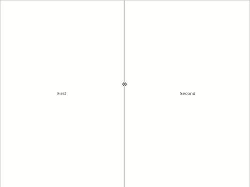

# Iced - Additional Widgets

[](https://docs.rs/iced_aw)
[](https://crates.io/crates/iced)
[](https://github.com/iced-rs/iced/blob/master/LICENSE)

This crate contains additional widgets for the GUI library [Iced](https://github.com/hecrj/iced).

Every widget is hidden by a feature gate. This allows you to cherry pick the widgets you actually need.

## Usage:

Include `iced_aw` as a dependency in your `Cargo.toml`:
```toml
[dependencies]
iced = "0.10.0"
iced_aw = { version = "0.6.0", default-features = false, features = [...] }
```

## Versioning

| `iced` version | `iced_aw` version |
| -------------- | ----------------- |
| 0.8            | 0.4               |
| 0.9            | 0.5               |
| 0.10           | 0.6               |

## Widgets


### Badge

<div align="center">
  
  
</div>

Please take a look into our examples on how to use badges.

Enable this widget with the feature `badge`.

### Card

<div align="center">
  

</div>

Please take a look into our examples on how to use cards.

Enable this widget with the feature `card`.

### Color Picker

<div align="center">


</div>

Please take a look into our examples on how to use color pickers.

Enable this widget with the feature `color_picker`.

### Date Picker

<div align="center">
  
  
</div>

Please take a look into our examples on how to use date pickers.

Enable this widget with the feature `date_picker`.

### Floating Action Button

<div align="center">


</div>

Please take a look into our examples on how to use floating elements.

Enable this widget with the feature `floating_element`.

### Modal

Modals are useful for showing some content as an overlay on top. In combination with the Card widget, modals can be used to create some kind of dialog panels.

<div align="center">


</div>


Please take a look into our examples on how to use modals.

Enable this widget with the feature `modal`.

### NumberInput

Just like TextInput, but only for numbers.

<div align="center">


</div>

Please take a look into our examples on how to use number inputs.

Enable this widget with the feature `number_input`.

*This widget does currently not support web*

### SelectionList

A selection space to show any options passed in.

<div align="center">


</div>

Enable this widget with the feature `selection_list`.

### Split

A split divides the available space to display two different elements.

<div align="center">


</div>

Please take a look into our examples on how to use Splits.

Enable Splits with the feature `split`.

*This widget is currently not supporting web*

### TabBar and Tabs

<div align="center">


</div>

Please take a look into our examples on how to use TabBars and Tabs.

Enable TabBars with the feature `tab_bar` and Tabs with `tabs`.

### Time Picker

<div align="center">


</div>

Please take a look into our examples on how to use time pickers.

Enable this widget with the feature `time_picker`.


### Menu

<div align="center">


</div>

Please take a look into our examples on how to use menus.

Enable this widget with the feature `menu`.

You might also want to enable the feature `quad` for drawing separators.


## Quickstart features

Quickstart features are pretty handy to start and experiment having everything like colors or icons available. Nevertheless, it is recommended to disable these features once the GUI is ready for production and to only include the things you really need.

### Color palette

This crate adds a predefined color palette based on the [CSS color palette](https://www.w3schools.com/cssref/css_colors.asp).

### Bootstrap icons

Thanks to [Bootstrap](https://icons.getbootstrap.com), iced_aw now contains ~1,200 icons to be used in an Iced GUI.

Enable icons with the feature `icons`.

*Note: the icon font with ~1,200 weights around 0.274 MB. This features should only be used for experimenting with all the icons.*
