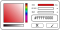

# Iced - Additional Widgets

**Disclaimer: This crate is part of a study project of mine. Please wait for your contributions until March 2021. Thank you very much!**

This crate contains additional widgets for the GUI library [Iced](https://github.com/hecrj/iced).

Every widget is hidden by a feature gate. This allows you to cherry pick the widgets you actually need.

## Usage:

Include `iced_aw` as a dependency in your `Cargo.toml`:
```toml
[dependencies]
iced =  { git = "https://github.com/hecrj/iced", rev = "ea1a7248d257c7c9e4a1f3989e68b58a6bc0c4ff" }
iced_aw = { git = "https://github.com/kaiden42/iced_aw", default-features = false, features = [...] }
```

**Why not Crates.io?**

This crate is currently based on top of the master branch of Iced. Crates.io [refuses](https://doc.rust-lang.org/cargo/reference/specifying-dependencies.html#specifying-dependencies-from-git-repositories) crates that uses git repositories as their dependencies. Once Iced becomes stable, `iced_aw` will be published on Crates.io as well.

## Widgets

Currently planned widgets are:
- [x] Badge
- [ ] Floating Action Button
- [ ] Card
- [ ] Modal
- [ ] Date Picker
- [ ] Time Picker
- [ ] Color Picker

### Badge

TODO

<center>


</center>

Please take a look into our examples on how to use badges.

Enable this widget with the feature `badge`.

### TabBar and Tabs

TODO

Please take a look into our examples on how to use TabBars and Tabs.

Enable TabBars with the feature `tab_bar` and Tabs with `tabs`.

### Floating Action Button

TODO

<center>


</center>

### Card

TODO

<center>


</center>

### Modal

TODO

<center>


</center>

### Date Picker

TODO

<center>


</center>

### Time Picker

TODO

<center>


</center>

### Color Picker

TODO

<center>



</center>

## Color palette

This crate add a predefined color palette based on the [CSS color palette](https://www.w3schools.com/cssref/css_colors.asp).

Enable colors with the feature `colors`.