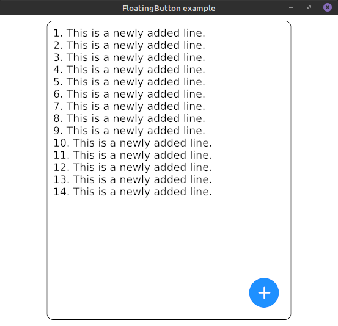
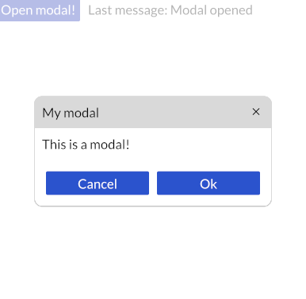

# Iced - Additional Widgets

This crate contains additional widgets for the GUI library [Iced](https://github.com/hecrj/iced).

Every widget is hidden by a feature gate. This allows you to cherry pick the widgets you actually need.

## Usage:

Include `iced_aw` as a dependency in your `Cargo.toml`:
```toml
[dependencies]
iced =  { git = "https://github.com/hecrj/iced", rev = "ea1a7248d257c7c9e4a1f3989e68b58a6bc0c4ff" }
iced_aw = { git = "https://github.com/kaiden42/iced_aw", default-features = false, features = [...] }
```

**Why not Crates.io?**

This crate is currently based on top of the master branch of Iced. Crates.io [refuses](https://doc.rust-lang.org/cargo/reference/specifying-dependencies.html#specifying-dependencies-from-git-repositories) crates that uses git repositories as their dependencies. Once Iced becomes stable, `iced_aw` will be published on Crates.io as well.

## Widgets

Currently planned widgets are:
- [x] Badge
- [x] Floating Action Button
- [x] Card
- [x] Modal
- [x] Date Picker
- [x] Time Picker
- [x] Color Picker

### Badge

<center>


</center>

Please take a look into our examples on how to use badges.

Enable this widget with the feature `badge`.
To enable predefined styles, enable the feature `colors`.

### Card

<center>


</center>


Please take a look into our examples on how to use cards.

Enable this widget with the feature `card`.
To enable predefined styles, enable the feature `colors`.

### Color Picker

<center>


</center>

Please take a look into our examples on how to use color pickers.

Enable this widget with the feature `color_picker`.

### Date Picker

<center>


</center>

Please take a look into our examples on how to use date pickers.

Enable this widget with the feature `date_picker`.

### Floating Action Button

<center>



</center>

Please take a look into our examples on how to use floating buttons.

Enable this widget with the feature `floating_button`.
To enable predefined styles for buttons, enable the feature `colors`.

### Modal

Modals are usefull for showing some content as an overlay on top. In combination with the Card widget, modals can be used to create some kind of dialog panels.

<center>



</center>


Please take a look into our examples on how to use modals.

Enable this widget with the feature `modal`.
To enable predefined styles, enable the feature `colors`.

### TabBar and Tabs

<center>


</center>

Please take a look into our examples on how to use TabBars and Tabs.

Enable TabBars with the feature `tab_bar` and Tabs with `tabs`.

### Time Picker

<center>


</center>

Please take a look into our examples on how to use time pickers.

Enable this widget with the feature `time_picker`.


## Quickstart features

Quickstart features are pretty handy to start and experiment having everything like colors or icons available. Nevertheless, it is recommended to disable these features once the GUI is ready for production and to only include the things you really need.

### Color palette

This crate add a predefined color palette based on the [CSS color palette](https://www.w3schools.com/cssref/css_colors.asp).

Enable colors with the feature `colors`.

### Bootstrap icons

Thanks to [Bootstrap](https://icons.getbootstrap.com), iced_aw now contains ~1,200 icons to be used in an Iced GUI.

Enable icons with the feature `icons`.

*Note: the icon font with ~1,200 weights around 0.5 MB. This features should only be used for experimenting with all the icons.*