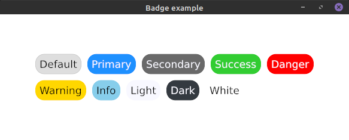
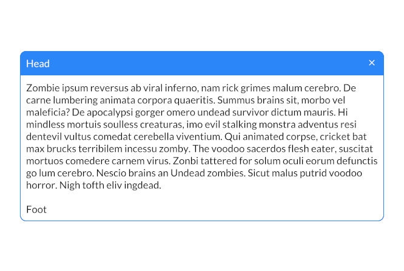
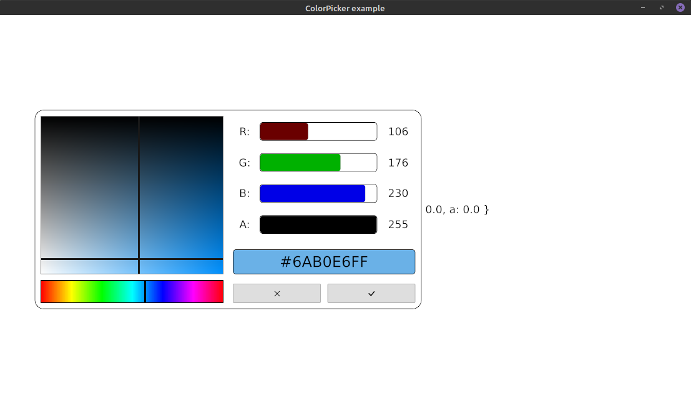
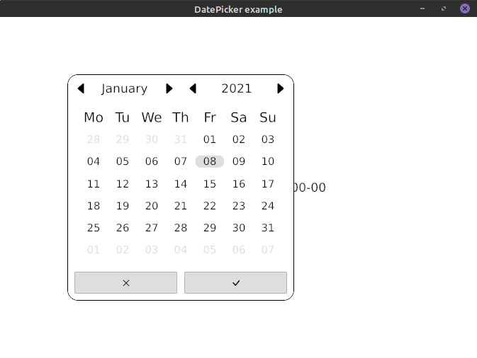
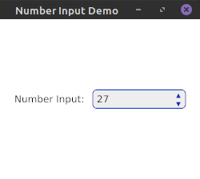
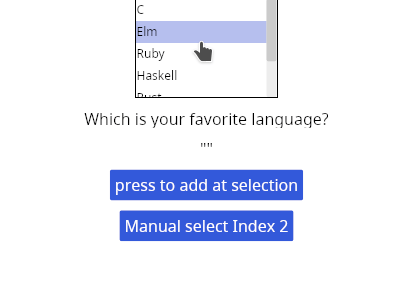
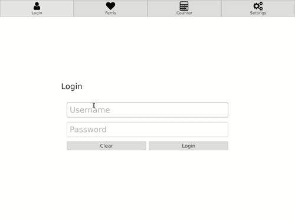
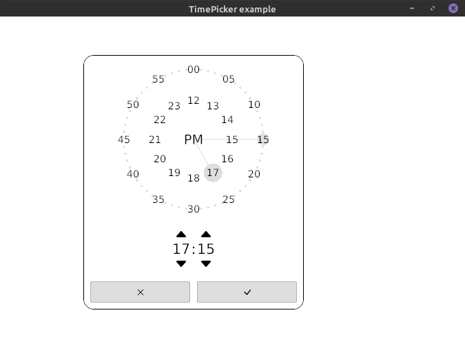
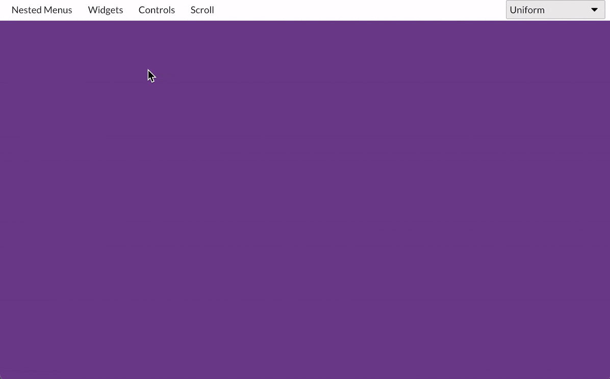
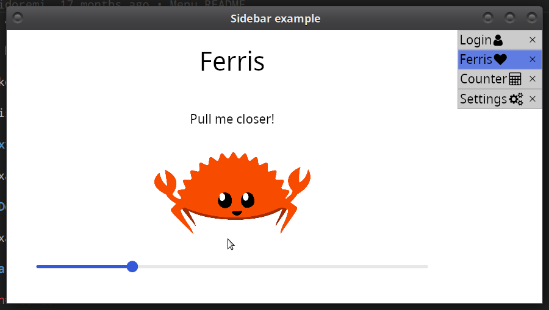

# Iced - Additional Widgets

[](https://docs.rs/iced_aw)
[](https://crates.io/crates/iced)
[](https://github.com/iced-rs/iced/blob/master/LICENSE)
[](https://discord.gg/3xZJ65GAhd)

This crate contains additional widgets for the GUI library [Iced](https://github.com/hecrj/iced).

Every widget is hidden by a feature gate. This allows you to cherry pick the widgets you actually need.

## Usage

Include `iced_aw` as a dependency in your `Cargo.toml`:

```toml
[dependencies]
iced = "0.13.0"
iced_aw = { version = "0.11.0", default-features = false, features = [...] }
```

## Versioning

| `iced` version | `iced_aw` version |
| -------------- | ----------------- |
| 0.10           | 0.7               |
| 0.12           | 0.9               |
| 0.13           | 0.10, 0.11        |

## Widgets

### Badge

<div align="center">

  
</div>

Please take a look into our examples on how to use badges.

Enable this widget with the feature `badge`.

### Card

<div align="center">


</div>

Please take a look into our examples on how to use cards.

Enable this widget with the feature `card`.

### Color Picker

<div align="center">


</div>

Please take a look into our examples on how to use color pickers.

Enable this widget with the feature `color_picker`.

### Date Picker

<div align="center">

  
</div>

Please take a look into our examples on how to use date pickers.

Enable this widget with the feature `date_picker`.

### NumberInput

Just like TextInput, but only for numbers.

<div align="center">


</div>

Please take a look into our examples on how to use number inputs.

Enable this widget with the feature `number_input`.

*This widget does currently not support web*

### SelectionList

A selection space to show any options passed in.

<div align="center">


</div>

Enable this widget with the feature `selection_list`.

### TabBar and Tabs

<div align="center">


</div>

Please take a look into our examples on how to use TabBars and Tabs.

Enable TabBars with the feature `tab_bar` and Tabs with `tabs`.

### Time Picker

<div align="center">


</div>

Please take a look into our examples on how to use time pickers.

Enable this widget with the feature `time_picker`.

### Menu

<div align="center">


</div>

Please take a look into our examples on how to use menus.

Enable this widget with the feature `menu`.

You might also want to enable the feature `quad` for drawing separators.

### Slide Bar

Please take a look into our examples on how to use slidebars.

Enable this widget with the feature `slide_bar`.

### Context Menu

See the example [here](./examples/context_menu/src/main.rs)

### Drop Down Menu

See the example [here](./examples/drop_down/src/main.rs)

### Sidebar

<div align="center">


</div>

Please take a look into our examples on how to use Sidebar.

Enable Sidebar with the feature `sidebar`.

Also included in this feature, are two widgets `sidebar::column::FlushColumn` and `sidebar::row::FlushRow` that flushes the end/start element to the opposite direction to the alignment of the container.

### Color palette

This crate adds a predefined color palette based on the [CSS color palette](https://www.w3schools.com/cssref/css_colors.asp).
