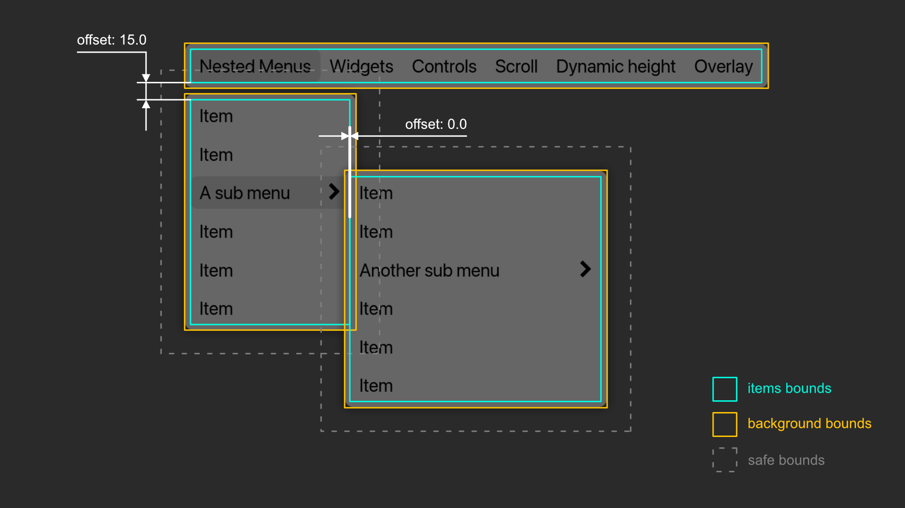
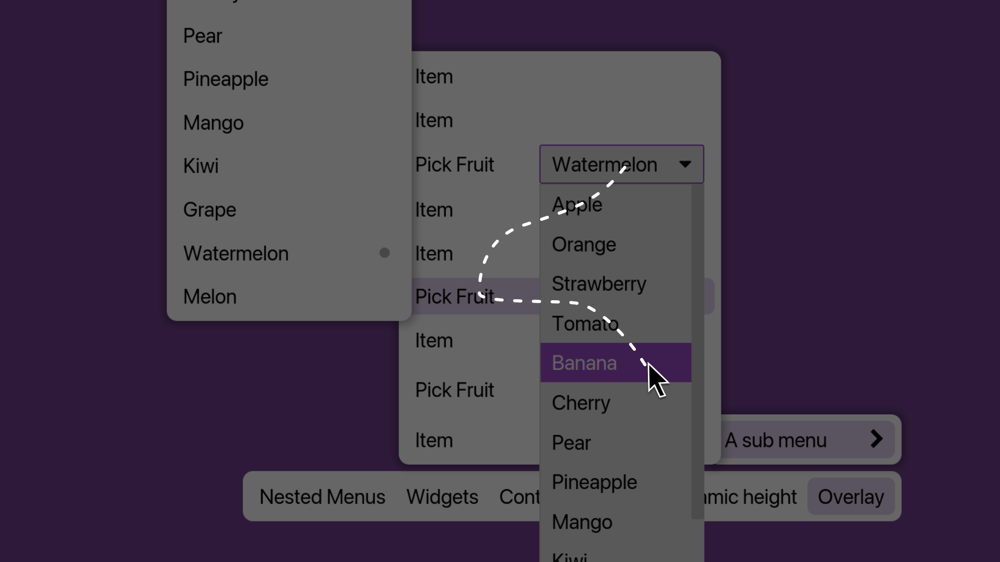
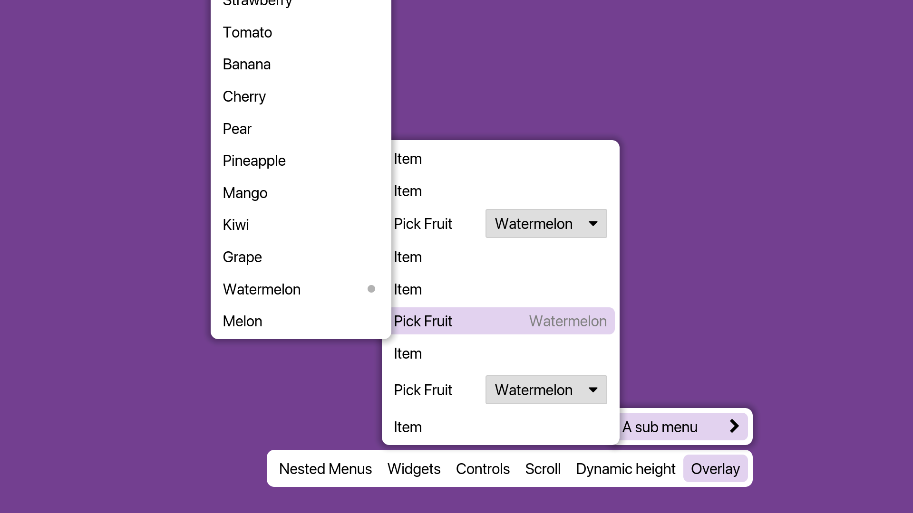

This is a guide on how to use the `MenuBar` widget.

This documentation and the `MenuBar` widget source code 
use the terms "parent menu" and "child menu". 
The term "submenu" is avoided, 
as it lacks a corresponding term for "parent menu", 
and the parent-child terminology 
can be more easily understood in a tree structure context.

# Overview

At its core, the menu system is a tree of widgets, 
the simplified version of the data structure looks like this:
```rust
MenuBar {
    roots: Vec<Item>,
    // ...
}

Item {
    widget,
    menu: Option<Menu>,
    // ...
}

Menu {
    items: Vec<Item>,
    // ...
}
```
Note that `MenuBar` is the actual widget you add to your UI, 
`Item` and `Menu` are helper structures 
used to build the menu tree, 
they cannot function on their own 
and must be used within a `MenuBar`.

`MenuBar` is the "root menu" 
and the entry point of the tree 
as it owns and manages the global state.

Building this nested structure manually in Rust can be cumbersome, 
it is recommended to use macros to build menus, 
as they save you from the boilerplate of wrapping every widget with `Item::new()` and `Item::with_menu()`.


# Macros

Three macros are provided:
- `menu_items!`
- `menu!`
- `menu_bar!`

`menu_items!` is the core macro, it returns a `Vec<Item>`. 

`menu!` and `menu_bar!` are convenient wrappers around `menu_items!`, 
equivalent to
`Menu::new(menu_items!( ... ))` and `MenuBar::new(menu_items!( ... ))` respectively.


Here is the `menu_items!` syntax:

```rust
menu_items!(
    (widget),       // creates an Item::new(widget)
    (widget, menu), // creates an Item::with_menu(widget, menu)
    expression,     // any expression that returns an Item
    // ...
)
```

A nice thing about this syntax is that 
when you need to build `Item`s with additional settings, 
you can create a helper function/closure, 
and simply put it before the parentheses, 
it will be treated as a normal function call expression.
```rust
let hold_item = |widget| Item::new(widget).close_on_click(false);

menu_items!(
    hold_item(widget), 
    // this is treated as an expression 
    // and creates an Item::new(widget).close_on_click(false)
    // ...
)
```

If you run into a `recursion limit reached` error, 
it is very likely there is a syntax error in your macro invocation, 
e.g. a double comma `,,`, 
or any unexpected sequence of non-alphabetical symbols like `?.-=+`.

This is a limitation of `macro_rules!`, 
it doesn't always provide clear errors for unexpected syntax, 
and we don't have much control over how errors are handled.

# Parameters Explained



### Offset and Padding

The items bounds is the bounding rectangle of all items in a menu without the scroll offset. 

The background bounds, 
which is the visual background of the menu, 
is a padded rectangle around the items bounds. 
You can change this padding by setting `Menu.padding`.

It's important to know that `Menu.padding` is not part of the layout calculation; 
it only affects appearance and the logic for closing menus. 
This simplifies layout calculations.

The trade-off is that, 
if you have a non-zero padding and `Menu.offset` is zero, 
the child menu will overlap the parent menu, 
which can be a bit confusing. 

If tight alignment is the appearance you want, 
you can set the offset to match the padding. 
For example, 
if a parent menu has a left and right padding of 6.0, 
setting the child menu's offset to 6.0 
will ensure they are tightly aligned
regarless of the open direction
(NOTE: Tight alignment for asymmetric paddings is not currently supported, 
if you have a left padding 6.0 and a right padding 3.0, 
you can't get a tight alignment for both open directions at the same time).


### Safe Bounds

The safe bounds is a padded rectangle around the background bounds.

It creates an invisible margin around each menu 
that prevents accidental closing. 
When the cursor moves from the menu background into this safe area, 
the menu remains open.

Here is a simplified version of the close logic:
```
if cursor is over background bounds {
    update the items
} else if cursor is over parent bounds {
    let the parent menu process the event
} else if cursor is over any background bounds of the ancestor menus {
    close the menu
} else {
    if cursor is over safe bounds {
        keep the menu open
    } else {
        close the menu
    }
}
```

### Close on Click

The close-on-click behavior follows an inheritance pattern:

Global <- MenuBar/Menu <- Item

A manu's setting (when it is `Some`) overrides the global settings.

An item's setting (when it is `Some`) overrides any ancestor settings.

Here is an overview of the data structure:
```rust
GlobalParameters {
    close_on_item_click: bool,
    close_on_background_click: bool,
    // ...
}

MenuBar {
    close_on_item_click: Option<bool>,
    close_on_background_click: Option<bool>,
    global_parameters: GlobalParameters,
    // ...
}

Menu {
    close_on_item_click: Option<bool>,
    close_on_background_click: Option<bool>,
    // ...
}

Item {
    close_on_click: Option<bool>,
    // ...
}
```
Here, "background" refers to 
the visual background plus the safe bounds for `Menu`s, 
but only the visual background area for `MenuBar`s 
(since menu bars don't have safe bounds).

By default, 
a menu closes when the cursor moves outside its safe bounds. 

A common alternative is to have menus stay open 
until the user clicks an item or the empty space outside the menu. 
You can achieve this with:
```rust
let mb = menu_bar!(
    ...
)
.close_on_item_click_global(true)
.close_on_background_click_global(true)
.safe_bounds_margin(f32::MAX);
```
By setting `safe_bounds_margin` to `f32::MAX`, 
the cursor effectively never leaves the safe bounds,
and the menus will only close upon a click.

Be aware that with this setting, 
if no item or background is set to close on click 
(either directly or through inheritance), 
you can end up with menus that never close.


# Nested Overlay

While `MenuBar` supports nested overlays, 
its interaction logic does not have special handling for 
complex, interactive overlays 
that can be created by the contained widgets. 
Using widgets like `PickList` within a menu 
can therefore lead to unexpected behavior. 



Consider a `PickList` opened from a menu item.

Note that iced passes `Cursor::Unavailable` to lower overlays 
when an upper overlay calls `shell.capture_event()`, 
meaning an upper overlay has processed the event.

In the image above, a `PickList` is opened from a menu item. 

1. If the cursor moves off the `PickList` overlay, 
`PickList` does not capture events that happen outside its bounds, 
the menu underneath is unaware of this overlay, 
and will process the `Cursor::Available(...)` it receives. 
This can result in multiple interactive overlays being visible at the same time.

2. If the cursor moves back over the `PickList`, 
the menu underneath receives a `Cursor::Unavailable`. 
the menu logic can't distinguish this from other cases, 
like the cursor leaving the window, 
and won't know to close the child menu.

The core issue is that 
managing interactions between multiple independent overlays 
is complex and highly use-case dependent, 
`MenuBar` cannot determine the intended interaction model 
of an arbitrary nested overlay

For example, a `Tooltip` is not expected to block menu interactions, whereas a `PickList` may. 
Since the `MenuBar` cannot know the difference, 
it defaults to blocking menu interaction 
upon receiving `Cursor::Unavailable`, 
which may not be ideal in all cases.

This complexity extends to other behaviors too, 
such as how close-on-click should be handled for nested overlays, 
or whether to perform out-of-safe-bounds checks 
when a nested overlay is active.

Therefore, 
the current implementation of the `MenuBar`'s interaction logic 
does not include mechanisms that
specifically handle nested overlays.

If a nested overlay-like functionality is unavoidable, 
we recommend either thoroughly testing your setup, 
or building it using menus themselves. 
For example, a `PickList` can be easily replicated with a menu. 
Check out the [menu example](https://github.com/iced-rs/iced_aw/blob/main/examples/menu.rs).




# Caveats

### Focus

Roughly speaking, a menu, and subsequently all of its items, 
is "in focus" ,
when the cursor is within its safe bounds. 
When the cursor is hovering over an item that opens a child menu, 
the parent menu remains in focus. 
Once the cursor enters the child menu, 
the child menu gains focus.

### Performance

When a menu is in focus, 
`Widget::update()` is called on all visible widgets in the menu
with the incoming event.

When a menu is not in focus, 
`Widget::update()` is called on all visible widgets in the menu
with a `window::Event::RedrawRequested` event.

This is due to changes from iced 0.14, 
`Widget::update()` has to be called on widgets 
even when they aren't in focus, 
otherwise their appearance won't update properly.

Be aware of the potential performance cost.

### Panic

It is assumed that `Widget::update()` does not capture 
the `window::Event::RedrawRequested` event 
(i.e. it does not call `Shell::capture_event()`
in response to a `window::Event::RedrawRequested` event).

A panic will occur when this assumption is violated.

# Debugging
`MenuBar` is a complex widget, 
and bugs may exist. 
If you encounter unexpected behavior or crashes, 
please feel free to open an issue. 

For contributors or if you'd like to debug it yourself, 
logs have been added throughout the `MenuBar` code using the `log` crate. 

To enable them in your application, enable the `debug_log` feature:
```
iced_aw = {version = "0.14", features = ["menu", "debug_log"]}
```
Then, use a logger implementation like `env_logger` in your application:
```rust
fn main(){
    env_logger::init();
    // ...
}
```

And set the `RUST_LOG` environment variable:

```
RUST_LOG=menu=debug
```

To run your application with logging enabled:
```
RUST_LOG=menu=debug cargo run
```

If you need to log to a file, you can redirect stderr (where `env_logger` writes by default):

```
RUST_LOG=menu=debug cargo run > path/to/your/log_file 2>&1 
```
Alternatively, 
you can configure `env_logger` to write to stdout in your application:
```rust
fn main(){
    env_logger::builder()
        .target(env_logger::Target::Stdout)
        .init();
    // ...
}
```
And then redirect stdout:
```
RUST_LOG=menu=debug cargo run > path/to/your/log_file
```

To run the menu example with debug enabled:
```
RUST_LOG=menu=debug cargo run --example menu --features "debug_log"
```